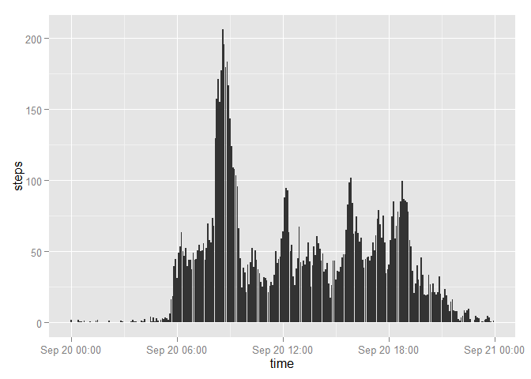
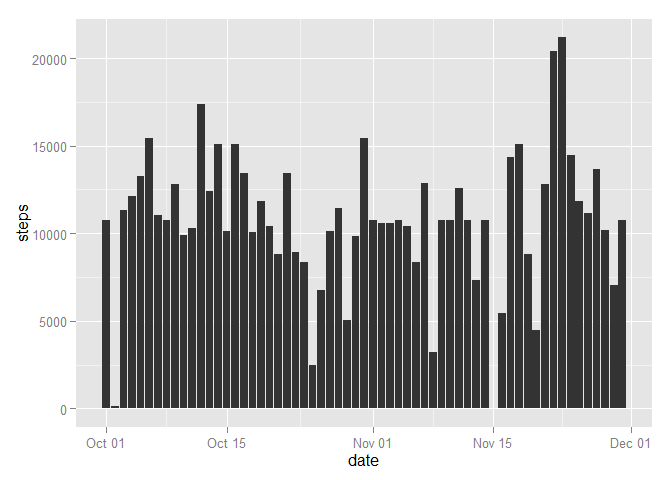

# Reproducible Research: Peer Assessment 1


## Loading and preprocessing the data
1. Download the csv file activity.csv into your pwd.

2. Read the csv file. Hint : Use the read.csv() function
* code  for reading in the dataset


```r
library(knitr)
library(ggplot2)
```

```
## Warning: package 'ggplot2' was built under R version 3.2.1
```

```r
MyData <- read.csv(file="E://R//course5//Course5//repdata-data-activity//activity.csv", header=TRUE, sep=",")
str(MyData)
```

```
## 'data.frame':	17568 obs. of  3 variables:
##  $ steps   : int  NA NA NA NA NA NA NA NA NA NA ...
##  $ date    : Factor w/ 61 levels "2012-10-01","2012-10-02",..: 1 1 1 1 1 1 1 1 1 1 ...
##  $ interval: int  0 5 10 15 20 25 30 35 40 45 ...
```

* preprocessing the data
+parsing the date string as a Date object.

```r
MyData$date <- as.Date(MyData$date, format="%Y-%m-%d")
str(MyData)
```

```
## 'data.frame':	17568 obs. of  3 variables:
##  $ steps   : int  NA NA NA NA NA NA NA NA NA NA ...
##  $ date    : Date, format: "2012-10-01" "2012-10-01" ...
##  $ interval: int  0 5 10 15 20 25 30 35 40 45 ...
```


## What is mean total number of steps taken per day?

handle the missing values in the dataset


```r
MyDataNoNa <- MyData[!is.na(MyData$steps),]

stepsPerDay <- rowsum(MyDataNoNa, MyDataNoNa$date)
stepsPerDay$date <- as.Date(row.names(stepsPerDay), format="%Y-%m-%d")
```


*histogram of the total number of steps taken each day


```r
library(ggplot2)
stepsPerDayPlot <- ggplot(stepsPerDay, aes(x = date, y = steps))
stepsPerDayPlot <- stepsPerDayPlot + geom_bar(stat = "identity")
stepsPerDayPlot
```

 


## What is the average daily activity pattern?
*Both the mean and median are reported

```r
mean(stepsPerDay$steps)
```

```
## [1] 10766.19
```

```r
median(stepsPerDay$steps)
```

```
## [1] 10765
```

*the 5-minute interval containing the maximum number of steps is reported


```r
stepsPerInterval <- aggregate(MyDataNoNa, list(interval = MyDataNoNa$interval), mean)
stepsPerInterval$time <- formatC(stepsPerInterval$interval, width = 4, format = "d", flag = "0")
stepsPerInterval$time <- as.POSIXct(stepsPerInterval$time, format="%H%M")
stepsPerIntervalPlot <- ggplot(stepsPerInterval, aes(x = time, y = steps)) +
   geom_bar(stat = "identity")
stepsPerIntervalPlot
```

 

```r
mostStepsOfTheDay <- stepsPerInterval[which.max(stepsPerInterval$steps),]$interval
mostStepsOfTheDay
```

```
## [1] 835
```

On average taken by this person is 835 .


## Imputing missing values
* description of a strategy for imputing missing data

create a new dataset that is same with original dataset , but with the NA filled in.


```r
MyDataImputed <- NULL
MyDataMissing <- MyData[is.na(MyData$steps), ]

for(i in 1:nrow(MyDataMissing)) {
    row <- MyDataMissing[i,]
    row$steps <- stepsPerInterval[stepsPerInterval$interval == row$interval, ]$steps[1]
    MyDataImputed <<- rbind(row, MyDataImputed)
}

MyDataImputed <- rbind(MyDataImputed, MyData[!is.na(MyData$steps), ])
```

* a histogram of the total number of steps taken each day after missing values were impute


```r
stepsPerDayImp <- rowsum(MyDataImputed, MyDataImputed$date)
stepsPerDayImp$date <- as.Date(row.names(stepsPerDayImp), format="%Y-%m-%d")

stepsPerDayImpPlot <- ggplot(stepsPerDayImp, aes(x = date, y = steps))
stepsPerDayImpPlot <- stepsPerDayImpPlot + geom_bar(stat = "identity")
stepsPerDayImpPlot
```

 

median and the average steps per day are exactly the same.


```r
mean(stepsPerDayImp$steps)
```

```
## [1] 10766.19
```

```r
median(stepsPerDayImp$steps)
```

```
## [1] 10766.19
```


## Are there differences in activity patterns between weekdays and weekends?

create a  factor variable with two levels (weekday and weekend )


```r
weekends <- MyDataImputed$date
weekends <- weekdays(weekends) %in% c("Saturday", "Sunday")
MyDataImputed <- transform(MyDataImputed, week = ifelse(weekends ,'weekend', 'weekday'))
MyDataImputed$week <- as.factor(MyDataImputed$week)
```

*a panel plot comparing the average number of steps taken per 5-minute interval across weekdays and weekends


```r
stepsPerIntervalByWeek <-
  aggregate(MyDataImputed$steps, list(interval = MyDataImputed$interval, week = MyDataImputed$week), mean)
str(stepsPerIntervalByWeek)
```

```
## 'data.frame':	576 obs. of  3 variables:
##  $ interval: int  0 5 10 15 20 25 30 35 40 45 ...
##  $ week    : Factor w/ 2 levels "weekday","weekend": 1 1 1 1 1 1 1 1 1 1 ...
##  $ x       : num  2.251 0.445 0.173 0.198 0.099 ...
```

```r
stepsPerIntervalByWeek$time <- formatC(stepsPerIntervalByWeek$interval, width = 4, format = "d", flag = "0")
stepsPerIntervalByWeek$time <- as.POSIXct(stepsPerIntervalByWeek$time, format="%H%M")
```


